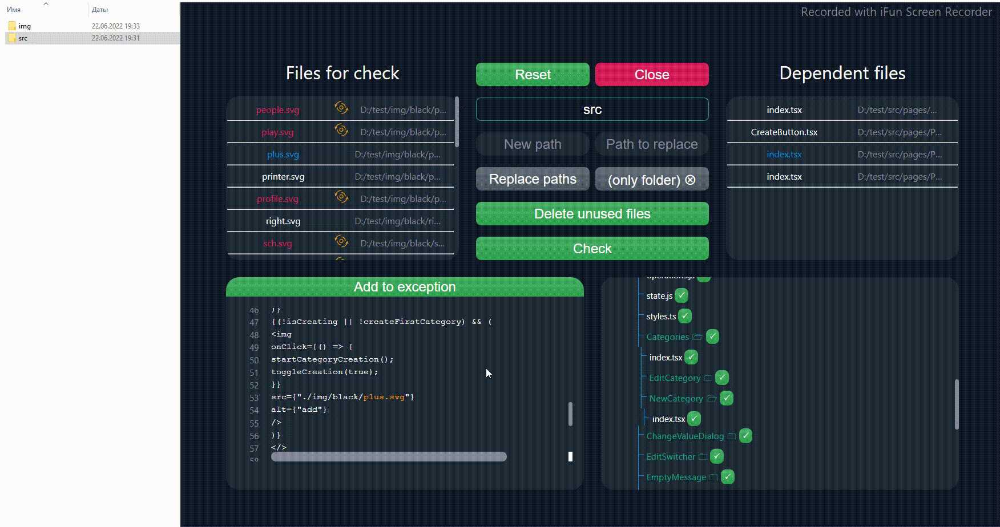

# ChimneySweep

This program helps the programmer to identify which files are used in the project and which are not. It is able to delete all unused resources, as well as change the paths for used resources. It will be very useful for cleaning large projects from unnecessary files.

- <a href="#howUse">How to use</a>
  - <a href="#check">Check</a>
  - <a href="#viewDependencies">Viewing dependencies</a>
  - <a href="#exceptions">Exceptions</a>
  - <a href="#replacingPath">Replacing the path</a>
  - <a href="#unusedFiles">Unused files</a>
  - <a href="#openFile">Opening a file in the file manager</a>
- <a href="#howBuild">How to build</a>
  - <a href="#windows">Windows</a>
  - <a href="#linux">Linux</a>
  - <a href="#mac">MacOS</a>

<h2 id="howUse">How to use</h2>

<h3 id="check">Check</h3>

When you click on the "Check" button, all files that have been added for verification will be searched in all files of the folder where dependencies are expected.

<h3 id="viewDependencies">Viewing dependencies</h3>

On the top left there is a field where you added files for verification. After you click on one of them, you will see that they lit up blue 🔵. This means that you have selected it and then in the opposite side on the right you will see in which files of the folder the selected file is present. By clicking on the name of the file in which there is a dependency, you can view its contents in the field on the bottom left. When you scroll through, you will come across a dependent file that will be marked yellow 🟡. There is also a button on top of this field to add this file to the exception.

<h3 id="exceptions">Exceptions</h3>

When you drag the folder in which you want to detect dependencies, then at the bottom right you will see the structure of this folder. By clicking on the checkboxes, you can add folders and files to exceptions. Then they will not be checked during the check and when you decide to replace the path, these files will also not be involved. Files added to exceptions are marked yellow 🟡.

<h3 id="unusedFiles">Unused files</h3>

After checking, some files are repainted in red 🔴, which means that these files were not found in the folder and are not being used. In the field you can click on the "Delete unused files" button. But before doing this, I recommend checking it by moving the specified files to another folder and checking how the project will work. Remember that sometimes pictures can be displayed due to some variables. Example: `` Replacing the path</h3>

- If you want to replace all the paths in the dependent files of the folder and change the name of the image itself, then enter a new path in the "New path" field and click on the "Replace paths" button.

- If you want to change the paths in the dependent files, but not change the name of the file itself, then click on the "(only folder)" button.

- If you want to change a certain path, then write "Path to replace". And then enter the new path "New path". Otherwise, only the path that makes up the name of the dependency file will change.

<h3 id="openFile">Opening a file in the file manager</h3>

There is a path near the name of a file. If you click on it, a file manager will open with the specified file.

<h2 id="howBuild">How to build</h2>

The application can be built for all platforms. In the package.json in the build section has all the necessary settings. To make an assembly for a particular operating system, you need to install `node.js` and <a href="https://github.com/ArtemPodloboshnikov/ChimneySweep/archive/refs/heads/main.zip">download the "Chimney Sweep" code</a>. After that, you need to open a command prompt in the code folder and enter the following commands: `npm i` and `nom run build:win(/linux/mac)` depending on your operating system. After that, the `dist` folder will appear in the same directory. It will contain the installation file or the program itself, depending on the settings in the `build` section.

<h3 id="windows">Windows</h3>

For Windows, you can build a portable version if you add "portable" to the array in the `build -> win -> target field`.

<h3 id="linux">Linux</h3>

There may be an error during assembly. But you need to go to the `dist` folder and find the program there. Or change the settings in `build` for your version of the Linux distribution.

<h3 id="mac">MacOS</h3>

I didn 't have a chance to check.
